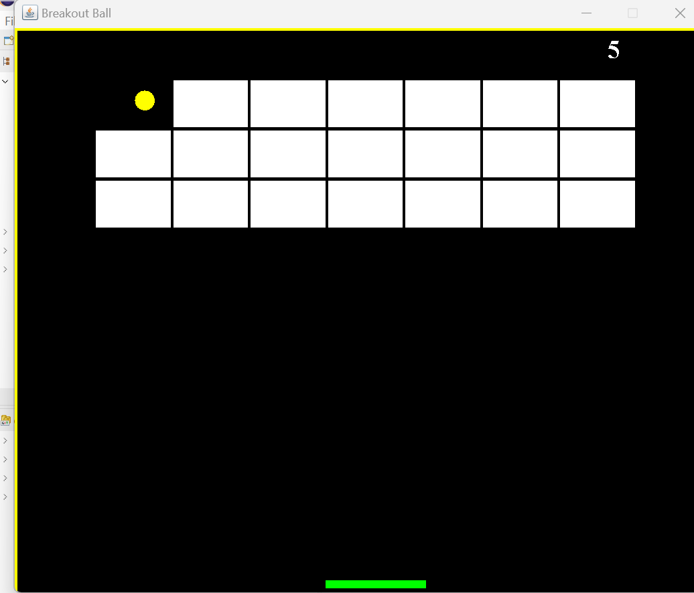

# Brick Breaker Game

This is a simple Brick Breaker game built using Java and Swing. The game features a paddle, a ball, and bricks that the player needs to break by bouncing the ball off the paddle.

## How to Play

1. Launch the game by running the `Main` class.
2. Use the left and right arrow keys to move the paddle horizontally.
3. Press the Enter key to start the game.
4. The objective is to break all the bricks with the ball bouncing off the paddle.
5. The game ends when all the bricks are broken, or the ball goes below the paddle.
6. You can restart the game by pressing Enter after the game ends.

## Gameplay Controls

- **Left Arrow Key:** Move the paddle to the left.
- **Right Arrow Key:** Move the paddle to the right.
- **Enter Key:** Start or restart the game.

## Game Features

- The game displays your score at the top right corner.
- The paddle's movement is limited within the game window.
- The ball bounces off the paddle and the walls.
- When the ball hits a brick, the brick disappears, and your score increases.
- The game ends when all the bricks are broken, and you win.
